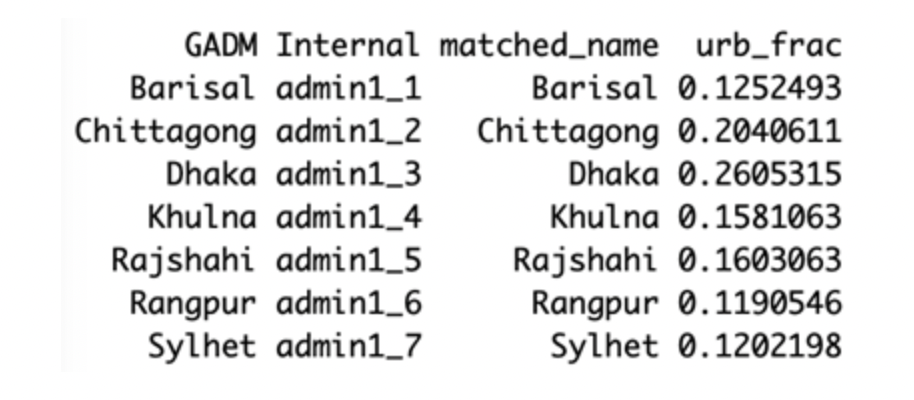

# UN Pipeline Overview

## Summary

This document provides detailed instructions for obtaining direct, smoothed direct, and urban/rural stratified Beta-binomial estimates for U5MR and NMR, as well as maps and figures of these results.

At some points in the pipeline, you will need to reference this sheet with specific information about each country:  https://docs.google.com/spreadsheets/d/1farrC3nJ0K-m35zzhZb3E7sSTGJ0iOg4ezZyhQVXt1A/edit#gid=0.  This will be referred to as the 'Country Info Sheet'.

## The Pipeline

#### Step 0: Prepare R

Make sure your R version is at least 4.1.0 (also RStudio is using R 4.1.0 or more recent version). Otherwise, installation of dependent packages might fail.

#### Step 1: Setting up file structure

-   Clone this repository on your local computer and open the 'UN-Subnational-Estimates' R project in RStudio.
-   Run create_folder.R. This will create the necessary file structure. *Make sure to specify the country of interest*

#### Step 2: Downloading Data

-   Download DHS data for country of interest from dhsprogram.com. If you haven't been given access to the DHS data, you must create an account and request access, or ask someone else in the group to download it for you. For each DHS survey, select the following files from the options menu (the file names will be slightly different depending on the country). Put the first downloaded folder in Data/*country of interest*/*survey year*/dhsStata and the second in Data/*country of interest*/*survey year*/dhsFlat.

-   If the country of interest also has MICS surveys (applicable only for Bangladesh, Madagascar, and Malawi), find the pre-processed data for that survey in the 'Data/MICS' folder of your cloned repository and move it into Data/*country of interest*/*survey year*

-   Finally, download the shapefiles. Note that we only need one set of files for the country of interest, not one for each survey. Check the "GADM notes" column on the Country Info Sheet to see if the country of interest is marked as needing 'alternative files'.

    -   If country of interest does NOT need alternative files, download the shapefile from <https://gadm.org/download_country.html> and put in Data/*country of interest* and rename the folder 'shapeFiles'.
    -   If country of interest does require alternative files, you can find those in 'Data/shapeFiles_alt/*country of interest*'. Move that shapeFiles folder into Data/*country of interest*.

{width=50%}

{width=50%}

{width=50%}

#### Step 3: Data Processing

Run the 'DataProcessing.R' script from the 'Rcode' folder. *Make sure to specify the country of interest at the top of the script!!*

#### Step 4: Direct Estimates

Run Direct_SmoothDirect.R. This script will calculate direct and smoothed direct NMR and U5MR estimates and generate figures. *Make sure to specify the country of interest where it is requested at the top of the script*

#### Step 5: Addressing Stratification

-   Check the 'Data/urban_frames' folder for the relevant country and frame year. If the file you need is already there, you can proceed to the next step. Otherwise, see the 'UR fraction' folder for further instructions.

-   Run the rest of ur_prop.R and make sure that the Admin-1 names in the final object, ref.tab, match up. In the end, the ref.tab object should look like the following:

{width=50%}

-   Run UR_thresholding.R to obtain urban/rural sampling weights to be used in the Beta-binomial model. *Make sure to specify the country of interest at the top of the script!!*

#### Step 6: Beta-Binomial Estimates

Run BB8.R and *Make sure to specify the country of interest at the top of the script!!*. This will fit U5MR and NMR models at the National, Admin-1, Admin-2 levels and draw benchmarked and un-benchmarked posterior estimates.
